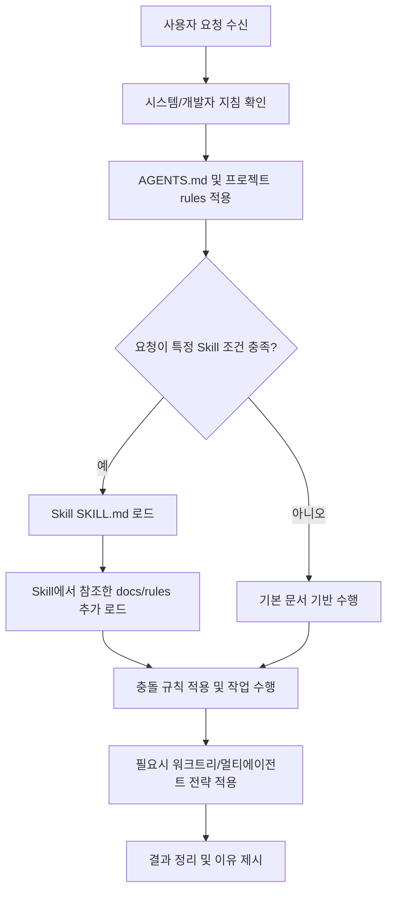

# Codex 온보딩 가이드

이 문서는 이 저장소에서 Codex를 사용할 때 신규 팀원이 무엇을 먼저 보고, 어떤 규칙을 근거로 작업해야 하며, 다른 AI 도구들과는 어떻게 구분해서 쓰면 좋은지 정리한 온보딩 가이드입니다.

핵심은 간단합니다. Codex는 단순히 답변만 하는 도구가 아니라, **현재 작업공간의 파일과 규칙을 읽고 실제 작업을 수행하는 에이전트**입니다. 그래서 프롬프트를 잘 쓰는 것만큼, 어떤 문서와 규칙을 같이 전달하느냐가 결과 품질에 큰 영향을 줍니다.

## 목차
- [AI 도구들](#ai-도구들)
- [Codex 란?](#codex-란)
- [Skills 란?](#skills-란)
- [docs 란?](#docs-란)
- [rules 란?](#rules-란)
- [AGENTS.md 란?](#agentsmd-란)
- [워크트리란?](#워크트리란)
- [멀티에이전트란?](#멀티에이전트란)
- [문서 로딩 우선순위와 동작 flow](#문서-로딩-우선순위와-동작-flow)
- [팀에 공유하면 좋은 Codex 사용법](#팀에-공유하면-좋은-codex-사용법)
- [실무 체크리스트](#실무-체크리스트)
- [FAQ](#faq)

## AI 도구들
AI 코딩 도구는 하나만 잘 쓰면 끝나는 경우보다, **작업 단계에 따라 적절한 도구를 고르는 경우**가 더 많습니다. 초급자에게 중요한 것은 “최고의 도구”를 찾는 것이 아니라, “지금 하려는 일에 맞는 도구를 고르는 기준”을 만드는 것입니다.

이 문서에서는 도구를 아래처럼 단순하게 분류합니다:
- 대화형 도구: 아이디어 정리, 문서 초안, 빠른 질문 응답
- IDE 중심 도구: 편집기 안에서 짧은 반복 수정과 코드 탐색
- 터미널 에이전트: 실제 저장소를 읽고 명령 실행, 수정, 검증까지 수행
- 오케스트레이션/하네스: 여러 도구나 워크플로를 감싸서 운영 보조

### 도구별 비교
| 도구             | 분류 | 주 사용 환경 | 강점 | 잘 맞는 작업 | 주의할 점 |
|----------------| --- | --- | --- | --- | --- |
| chatGPT        | 대화형 도구 | 웹/앱 | 빠른 아이디어 정리와 초안 작성 | 요구사항 정리, 설명문 초안, 비개발자와의 커뮤니케이션 | 현재 로컬 저장소 상태를 직접 읽는 작업에는 한계가 있습니다. |
| Claude         | 대화형 도구 | 웹/앱 | 긴 문맥 요약과 설계 토론 | 긴 문서 비교, 정책 정리, 구조화된 설명 | 로컬 파일/명령과 직접 연결되지 않으면 실행 근거가 약해질 수 있습니다. |
| Claude Code    | 터미널 에이전트 | 터미널/로컬 저장소 | 코드 읽기, 수정, 명령 실행을 한 흐름으로 처리 | 구현, 디버깅, 리팩터링, 검증 | 범위와 검증 기준을 함께 줘야 결과가 안정적입니다. |
| Codex          | 터미널 에이전트 | 터미널/앱/로컬 저장소 | 실제 작업공간 기준 탐색, 수정, 검증 | 규칙이 많은 저장소 작업, 문서/코드 개정, 리뷰 | 어떤 문서를 우선 참고해야 하는지 같이 주는 편이 좋습니다. |
| Cursor         | IDE 중심 도구 | 에디터 | 파일 단위 수정과 짧은 반복 작업 | 프론트엔드 수정, 작은 코드 변경, 에디터 내 탐색 | 긴 작업은 범위를 잘라서 요청하지 않으면 맥락이 퍼질 수 있습니다. |
| Amp            | IDE 중심 도구 | 에디터/코드베이스 | 코드베이스 맥락을 붙여 탐색과 작성 보조 | 빠른 탐색, 수정 초안, 코드 이해 | 팀 규칙과 검증 절차는 별도로 챙겨야 합니다. |
| Gemini CLI     | 터미널 에이전트 | 터미널/로컬 저장소 | CLI 기반 자동화와 에이전트형 작업 흐름 | 스크립트 작업, 탐색, 수정 자동화 | 문서 규칙과 프로젝트 제약을 명시적으로 같이 줘야 합니다. |
| oh-my-opencode | 오케스트레이션/하네스 | OpenCode 위 레이어 | 여러 모델과 워크플로 운영 보조 | 실험적 조합, 운영 흐름 정리 | 기본 도구의 역할을 먼저 이해하지 않으면 오히려 복잡해질 수 있습니다. |

참고:
- 제품 기능과 UI는 자주 바뀝니다. 세부 기능 비교보다 “어떤 상황에서 쓰는가”를 기준으로 이해하는 것이 더 오래 갑니다.
- 이 문서의 도구 설명은 입문자용 사용 맥락 중심이며, 최신 기능 목록 전체를 다루지는 않습니다.
- 이 문서에서는 `Amp`를 “IDE 중심 코딩 도구”, `oh-my-opencode`를 “여러 도구를 감싸는 운영 보조 레이어”로 이해하고 설명합니다.

### 어떻게 고르면 좋은가
- 아이디어 정리나 초안 작성이 먼저면: GPT, Claude 같은 대화형 도구
- 실제 저장소를 읽고 수정까지 맡기려면: Codex, Claude Code, Gemini CLI 같은 터미널 에이전트
- 에디터 안에서 짧고 빠르게 반복하려면: Cursor, Amp 같은 IDE 중심 도구
- 여러 도구를 하나의 운영 레이어로 감싸고 싶다면: oh-my-opencode 같은 보조 레이어

핵심은 한 도구만 고집하지 않는 것입니다. 예를 들어, 요구사항 정리는 대화형 도구로 하고, 실제 수정은 Codex로 하고, 마지막 미세 조정은 IDE 도구로 하는 식의 조합이 실무에서 자주 쓰입니다.

## Codex 란?
Codex는 코드 작성, 분석, 수정, 리뷰, 디버깅, 문서화까지 수행하는 AI 코딩 에이전트입니다. 이 레포에서는 Codex가 단순히 질문에 답하는 수준을 넘어서, **현재 저장소의 파일과 규칙을 읽고 실제 작업 흐름을 따라가는 실행 주체**로 동작합니다.

왜 중요하나:
- 같은 요청이라도 어떤 규칙 파일을 먼저 읽었는지에 따라 결과가 달라집니다.
- 문서 저장소든 코드 저장소든, Codex는 로컬 컨텍스트를 기반으로 판단합니다.
- 답변 품질보다 더 중요한 것은 “어떤 근거로 그렇게 판단했는가”입니다.

처음 보는 사람은 이렇게 이해하면 됩니다:
- ChatGPT처럼 대화만 하는 도구가 아니라, 작업공간을 읽고 바꾸는 도구에 가깝습니다.
- 그래서 요청할 때 목표만 주는 것보다, 참고해야 할 파일과 제약을 같이 주는 편이 좋습니다.
- 처음에는 [README.md](./README.md), [AGENTS.md](./AGENTS.md), 이 문서를 같이 보는 것이 가장 빠릅니다.

이 저장소 예시:
- [onboarding-codex.md](./onboarding-codex.md): Codex 사용 온보딩 문서
- [README.md](./README.md): 저장소 개요와 설치/사용 진입점
- [AGENTS.md](./AGENTS.md): 프로젝트 목적과 규칙의 최상위 설명

자주 하는 오해:
- “모델이 충분히 똑똑하면 규칙을 안 줘도 알아서 잘 한다”
- 실제로는 반대입니다. Codex 같은 에이전트는 **규칙과 문맥을 같이 줄수록 안정적으로 동작**합니다.

## Skills 란?
Skill은 “반복 작업을 표준화한 실행 지침서”입니다. 핵심 파일은 `SKILL.md`이며, 특정 작업을 할 때 무엇을 먼저 확인하고, 어떤 순서로 진행하고, 무엇으로 검증할지를 정리해 둔 운영 매뉴얼에 가깝습니다.

왜 중요하나:
- 같은 유형의 작업을 사람마다 다르게 처리하지 않게 해줍니다.
- “무엇을 할까?”보다 “어떻게 진행할까?”를 표준화합니다.
- 구현뿐 아니라 검증, 리뷰, 마무리까지 포함하는 경우가 많습니다.

Skill이 하는 역할:
- 작업 유형 판단: 무엇을 해야 하는지 정합니다.
- 실행 순서 제시: 어떤 순서로 진행할지 정합니다.
- 검증 방식 제시: 어떤 기준으로 끝났다고 볼지 정합니다.

처음 보는 사람은 이렇게 보면 됩니다:
- 요청에 맞는 Skill이 있으면, 그 Skill이 사실상 작업 절차의 기본값이 됩니다.
- Skill 이름만 보는 것이 아니라, 실제 [SKILL.md](./skills/git-commit-msg/SKILL.md) 본문을 읽어야 합니다.
- “프롬프트 템플릿”보다는 “실행 플레이북”에 더 가깝다고 이해하면 맞습니다.

이 저장소 예시:
- [skills/git-commit-msg/SKILL.md](./skills/git-commit-msg/SKILL.md): 커밋 메시지 작성 규칙
- [skills/front-end-code-guidelines/SKILL.md](./skills/front-end-code-guidelines/SKILL.md): 프론트엔드 작업 시 기준
- [skills/verification/verify-implementation/SKILL.md](./skills/verification/verify-implementation/SKILL.md): 구현 검증 절차

자주 하는 오해:
- “Skill은 있으면 참고하고, 없어도 비슷하게 하면 된다”
- 실제로는 Skill이 있으면 그 절차를 따르는 편이 품질과 일관성이 높습니다.

## docs 란?
이 저장소에서 docs는 Codex가 판단 근거로 삼는 문서 전체를 뜻합니다. 단순히 README만 의미하는 것이 아니라, 프로젝트 내부 문서와 참조 문서를 모두 포함합니다.

이 저장소에서 docs는 크게 두 가지입니다:
- 프로젝트 내부 문서: `README.md`, `AGENTS.md`, 규칙 파일, 가이드 문서
- 참조 문서: Skill이 가리키는 문서, 외부 공식 문서, 도구/플랫폼 설명서

왜 중요하나:
- Codex는 답변을 만들 때뿐 아니라 작업 방식을 정할 때도 문서를 참고합니다.
- 문서가 부족하거나 오래되면, 에이전트의 판단도 흔들릴 수 있습니다.
- 문서 저장소에서는 코드보다 문서가 더 중요한 “실행 근거”가 됩니다.

처음 보는 사람은 이렇게 보면 됩니다:
- 먼저 내부 문서를 보고, 부족한 부분만 외부 문서로 보완합니다.
- 프로젝트 규칙과 충돌할 수 있는 외부 문서는 보조 근거로만 사용합니다.
- 문서가 여러 개일 때는 “가장 상위 규칙 문서”부터 읽습니다.

이 저장소 예시:
- [README.md](./README.md)
- [AGENTS.md](./AGENTS.md)
- [onboarding-codex.md](./onboarding-codex.md)
- [.claude/CLAUDE.md](./.claude/CLAUDE.md)
- [.aiassistant/rules/agents-rule.md](./.aiassistant/rules/agents-rule.md)

자주 하는 오해:
- “README만 읽어도 충분하다”
- 실제로는 README는 입구일 뿐이고, 작업 방식은 AGENTS와 rules, Skills에서 정해지는 경우가 많습니다.

## rules 란?
`rules`는 팀 규칙과 작업 규칙의 모음입니다. 스타일 가이드만 뜻하는 것이 아니라, 어떤 우선순위로 판단하고, 어떤 실수를 피하고, 어떤 품질 기준으로 마무리할지를 정리한 문서 집합입니다.

이 저장소에서 실제로 확인할 수 있는 규칙 기반:
- [.aiassistant/rules/agents-rule.md](./.aiassistant/rules/agents-rule.md)
- [.aiassistant/rules/code-refactoring.md](./.aiassistant/rules/code-refactoring.md)
- [.aiassistant/rules/react-refactoring.md](./.aiassistant/rules/react-refactoring.md)
- 프로젝트 운영 문서의 규칙 섹션

왜 중요하나:
- 에이전트가 “가능한 답”이 아니라 “팀이 허용하는 답”을 내도록 만듭니다.
- 코드 스타일, 문서 스타일, 검증 기준, 우선순위 충돌 해결에 영향을 줍니다.
- 사람이 바뀌어도 일관된 결과를 유지하기 쉽습니다.

처음 보는 사람은 이렇게 보면 됩니다:
- 요청하기 전에 어떤 규칙이 적용되는지 먼저 확인합니다.
- 구현 요청 전에 리팩터링, 설계, 검증 규칙이 따로 있는지 확인합니다.
- 규칙 파일이 여러 개면, 현재 작업과 직접 관련된 규칙부터 읽습니다.

자주 하는 오해:
- “rules는 린트나 코드 스타일 정도만 다룬다”
- 실제로는 작업 순서, 리뷰 관점, 예외 처리, 검증 기준까지 포함할 수 있습니다.

## AGENTS.md 란?
`AGENTS.md`는 프로젝트의 “최상위 실행 규칙 문서”입니다. 이 문서는 저장소가 어떤 목적을 가지고 있고, 어떤 문서를 우선해서 읽어야 하며, 어떤 방식으로 작업해야 하는지를 설명하는 출발점입니다.

이 레포의 예:
- [AGENTS.md](./AGENTS.md)

주요 역할:
- 프로젝트 목적과 범위를 정의합니다.
- 폴더 구조와 문서 성격을 설명합니다.
- 다른 규칙 문서를 어디서 봐야 하는지 알려줍니다.
- 프로젝트별 커스터마이징이 필요한 부분을 구분하게 해줍니다.

처음 보는 사람은 이렇게 보면 됩니다:
- 새 저장소에 들어왔을 때 가장 먼저 읽을 문서입니다.
- 빌드/테스트 중심 저장소인지, 문서 중심 저장소인지도 여기서 먼저 파악합니다.
- Codex에게 작업을 맡길 때, AGENTS.md를 참고하라고 같이 전달하면 결과 품질이 좋아집니다.

이 저장소에서 특히 중요한 점:
- 이 레포는 실제 애플리케이션 실행보다 문서와 규칙 재사용이 중심입니다.
- 그래서 일반적인 “설치 후 테스트 실행” 흐름보다, 문서 구조와 규칙 연결 관계를 이해하는 것이 더 중요합니다.

자주 하는 오해:
- “AGENTS.md는 템플릿 문서라 대충 봐도 된다”
- 실제로는 저장소마다 내용이 달라지고, 작업 방식의 기본값이 이 문서에서 정해지는 경우가 많습니다.

## 워크트리란?
워크트리(`git worktree`)는 동일한 Git 저장소에서 여러 개의 작업 디렉터리를 병렬로 만들 수 있게 하는 기능입니다. 같은 저장소를 기준으로 브랜치와 작업 컨텍스트를 분리할 수 있어, 실험 작업이나 병렬 작업에 유리합니다.

왜 중요하나:
- 현재 작업 중인 내용을 건드리지 않고 다른 작업을 시작할 수 있습니다.
- 코드 수정, 문서 수정, 리뷰 대응을 분리해 충돌을 줄일 수 있습니다.
- 메인 브랜치나 중요한 작업공간을 보호하기 쉽습니다.

처음 보는 사람은 이렇게 보면 됩니다:
- “큰 기능 개발”에만 필요한 게 아닙니다.
- 문서 개정, 실험 브랜치, 검증 전용 작업공간처럼 작은 작업에도 유용합니다.
- 현재 작업공간이 더럽거나 병렬 작업이 필요할 때 먼저 떠올리면 좋습니다.

이 저장소 기준 메모:
- 현재 저장소에 `.worktrees`나 `worktrees` 디렉터리가 항상 존재하는 것은 아닙니다.
- 다만 작업 정책 관점에서는 `.worktrees` 또는 `worktrees`를 우선 후보로 보는 설명이 이미 문서에 등장합니다.

자주 하는 오해:
- “워크트리는 대규모 기능 개발 때만 쓴다”
- 실제로는 메인 브랜치 보호와 병렬 실험을 위해 작은 작업에도 충분히 가치가 있습니다.

## 멀티에이전트란?
멀티에이전트는 하나의 큰 작업을 여러 하위 에이전트로 나눠 병렬 또는 분업 형태로 처리하는 방식입니다. 핵심은 무조건 많이 나누는 것이 아니라, **서로 독립적인 작업만 분리**하는 것입니다.

왜 중요하나:
- 독립 작업은 병렬로 처리해 시간을 줄일 수 있습니다.
- 구현과 검토를 분리해 품질을 높일 수 있습니다.
- 문서 작성, 링크 점검, 규칙 검토처럼 결이 다른 작업을 나누기 좋습니다.

이 레포 관점의 분류:
- 독립 작업: 병렬 분산 처리에 적합
- 서로 의존적인 작업: 순차 처리에 적합
- 구현 후 검토: 스펙 리뷰, 품질 리뷰, 검증 분리 가능

처음 보는 사람은 이렇게 보면 됩니다:
- 한 문서를 동시에 여러 명이 뜯어고치는 방식이 아닙니다.
- 서로 간섭이 적은 태스크만 병렬화해야 효과가 있습니다.
- 문서 초안 작성, 링크 검수, 체크리스트 보강처럼 역할이 분리될 때 특히 좋습니다.

자주 하는 오해:
- “멀티에이전트는 항상 더 빠르다”
- 의존성이 높은 작업에서는 오히려 조율 비용이 커져 느려질 수 있습니다.

## 문서 로딩 우선순위와 동작 flow
Codex는 문서를 아무 순서로나 읽지 않습니다. 실제로는 상위 지시, 프로젝트 규칙, Skills, 참조 문서, 현재 컨텍스트 순으로 우선순위를 두고 해석하는 편이 안정적입니다.

처음 보는 사람은 이 순서로 이해하면 됩니다:
1. 가장 먼저 상위 지시와 프로젝트의 최상위 규칙을 본다.
2. 현재 요청에 맞는 Skill이 있는지 본다.
3. Skill이 참조하는 문서와 rules를 추가로 읽는다.
4. 마지막으로 현재 대화 맥락과 최근 변경사항을 반영한다.

아래는 이 저장소에서의 실무 운용 기준 우선순위입니다.

1순위: 상위 지시
- 시스템/개발자 수준 지침
- 코드 실행 제약, 보안, 응답 형식 규칙

2순위: 프로젝트 핵심 규칙
- [AGENTS.md](./AGENTS.md)
- [.aiassistant/rules/agents-rule.md](./.aiassistant/rules/agents-rule.md)
- 현재 작업과 직접 관련된 rules 문서

3순위: Skills 분기
- `description`이 어떤 상황에서 Skill을 써야 하는지 알려줍니다.
- 실제 절차는 각 Skill 본문에서 정합니다.

4순위: Skills가 가리키는 참고 문서
- 관련 규칙, 매뉴얼, README, 문제 해결 문서
- 필요할 때만 외부 공식 docs

5순위: 현재 컨텍스트
- 대화 맥락
- 최근 변경사항
- 실패 로그와 에러 메시지

### 동작 예시 flow


### 충돌 해석 규칙
- AGENTS와 rule/skill이 충돌하면 상위 지시 성격이 더 강한 문서를 우선합니다.
- Skill의 `description`은 선택 조건이고, 실제 동작은 `SKILL.md` 본문을 따릅니다.
- 문서 로딩은 “필요 최소, 최신 기준”으로 가져가야 중복과 혼선을 줄일 수 있습니다.

자주 하는 오해:
- “현재 대화에서 방금 말한 내용이 항상 최우선이다”
- 실제로는 프로젝트 규칙이나 상위 지시가 그보다 우선할 수 있습니다.

## 팀에 공유하면 좋은 Codex 사용법
Codex를 잘 쓰는 팀은 “좋은 질문”보다 “좋은 작업 입력”을 줍니다. 목표만 던지는 대신, 성공 기준과 근거 문서를 함께 주면 결과 품질이 훨씬 안정적입니다.

### 1. 요청할 때 5가지를 같이 주기
- 목표: 무엇을 바꾸고 싶은가
- 성공 기준: 어떤 상태면 완료인가
- 제약: 수정 범위, 금지 사항, 유지해야 할 점
- 참고 파일: 먼저 읽어야 할 문서나 코드
- 검증 기준: 무엇으로 확인할 것인가

예:
```text
`onboarding-codex.md`만 수정해줘.
대상 독자는 신규 팀원이고, 각 목차 설명을 더 풀어써줘.
`AI 도구들`, `팀에 공유하면 좋은 Codex 사용법` 섹션을 추가해줘.
`AGENTS.md`, `README.md`, 기존 `onboarding-codex.md`를 먼저 보고,
링크는 상대경로로 맞춰줘.
```

### 2. 탐색, 설계, 구현, 검증을 한 번에 섞지 않기
한 요청 안에 모든 단계를 섞으면 에이전트도 우선순위를 흐리게 잡을 수 있습니다. 아래처럼 작업 단계를 나누면 결과가 좋아집니다.

- 탐색 요청: 현재 구조와 관련 문서를 먼저 찾기
- 설계 요청: 어떤 방향으로 수정할지 계획 세우기
- 구현 요청: 실제 파일 수정
- 검증 요청: 링크, 톤, 누락 사항 점검

### 3. 에러와 맥락은 요약하지 말고 원문도 같이 주기
- 에러 메시지는 복붙 원문이 가장 좋습니다.
- “대충 이런 에러”라고 요약하면 원인 파악이 느려질 수 있습니다.
- 문서 개정 작업도 마찬가지로, 기존 문장과 원하는 톤을 같이 주는 편이 좋습니다.

### 4. 애매하면 먼저 계획부터 요청하기
바로 구현시키는 것보다, 먼저 어떤 파일을 보고 어떤 순서로 바꿀지 계획을 받는 것이 안전한 경우가 많습니다.

특히 이런 경우에는 계획 요청이 유리합니다:
- 수정 범위가 여러 파일에 걸쳐 있을 때
- 새 섹션이나 새 기능을 추가할 때
- 팀 규칙과 충돌할 가능성이 있을 때
- 결과물의 독자 수준이 중요할 때

### 5. 결과물에는 근거와 검증도 같이 요청하기
“끝났어?”보다 아래처럼 요청하는 편이 좋습니다.
- 어떤 문서를 근거로 수정했는지 알려줘
- 어떤 검증을 했는지 알려줘
- 남아 있는 리스크가 있으면 같이 적어줘

### 재사용 가능한 짧은 프롬프트 예시
탐색용:
```text
이 저장소에서 Codex 온보딩 문서와 직접 관련된 규칙 파일과 가이드를 먼저 찾아줘.
아직 수정은 하지 말고, 어떤 파일을 근거로 봐야 하는지만 정리해줘.
```

구현용:
```text
`onboarding-codex.md`만 수정해줘.
대상 독자는 신규 팀원이고, 도구 비교 섹션과 Codex 사용 팁 섹션을 추가해줘.
기존 제목은 유지하고 링크는 상대경로로 맞춰줘.
```

검토용:
```text
방금 수정한 `onboarding-codex.md`를 리뷰해줘.
목차 링크, 상대경로 링크, 입문자 가독성, 과장된 표현 여부를 우선순위 순으로 알려줘.
```

## 실무 체크리스트
- Codex 요청 전, 어떤 규칙 파일이 적용되는지 확인했는가
- [AGENTS.md](./AGENTS.md)와 관련 rules를 먼저 확인했는가
- 요청이 여러 작업을 담고 있다면 Skill이 필요한지 판단했는가
- 문서 작업인지 코드 작업인지, 혹은 둘 다인지 구분했는가
- 워크트리 사용이나 브랜치 분리가 필요한 작업인지 판단했는가
- 멀티에이전트가 유리한 독립 태스크인지 확인했는가
- 참고 파일과 수정 범위를 요청에 포함했는가
- 결과물에 근거 문서와 검증 결과를 남기도록 요청했는가

## FAQ
- Skills가 항상 로딩되나?
  - 아님. 요청 조건이 맞을 때만 로드합니다. 다만 맞는 Skill이 있다면 그 절차를 따르는 편이 좋습니다.
- Skills만 보면 되나?
  - 아님. AGENTS + rules + docs + 현재 컨텍스트가 함께 기준을 구성합니다.
- GPT나 Claude만으로 충분한가?
  - 아이디어 정리나 초안에는 충분할 수 있지만, 실제 저장소 수정과 검증까지 맡기려면 Codex나 Claude Code 같은 에이전트형 도구가 더 잘 맞는 경우가 많습니다.
- 언제 Codex나 Claude Code 같은 에이전트를 써야 하나?
  - 로컬 저장소를 읽고, 파일을 수정하고, 명령을 실행하고, 결과를 검증해야 할 때입니다.
- 멀티에이전트가 무조건 빠른가?
  - 독립 작업에서만 유리하며, 의존 작업에서는 오히려 느려질 수 있습니다.
- 에이전트에게 무엇을 같이 주면 결과가 좋아지나?
  - 목표, 성공 기준, 제약, 참고 파일, 검증 기준을 같이 주면 가장 안정적입니다.
