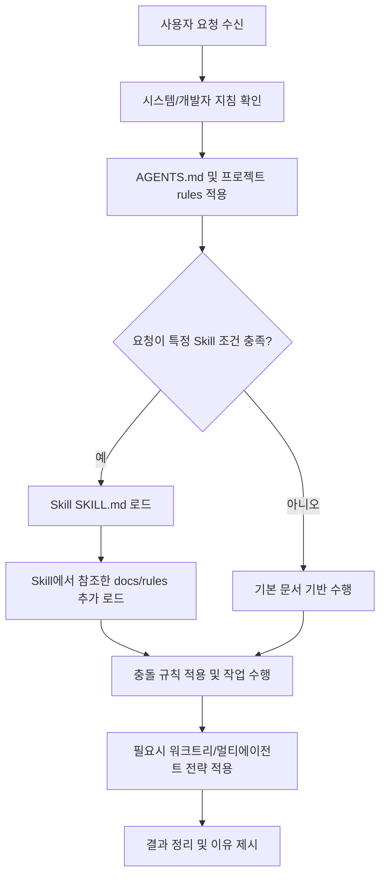

# Codex 온보딩 가이드

이 문서는 이 저장소에서 Codex를 사용할 때 어떤 규칙과 문서를 어떤 순서로 보는지 정리한 가이드입니다.

## 목차
- [Codex 란?](#codex-란)
- [Skills 란?](#skills-란)
- [docs 란?](#docs-란)
- [rules 란?](#rules-란)
- [AGENTS.md 란?](#agentsmd-란)
- [워크트리란?](#워크트리란)
- [멀티에이전트란?](#멀티에이전트란)
- [문서 로딩 우선순위와 동작 flow](#문서-로딩-우선순위와-동작-flow)
- [실무 체크리스트](#실무-체크리스트)
- [FAQ](#faq)

## Codex 란?
Codex는 코드 작성, 분석, 수정, 리뷰, 디버깅, 문서화까지 수행하는 AI 코딩 에이전트입니다.
이 레포에서는 Codex가 코드 실행 환경과 문서 규칙을 함께 읽고, 규칙 기반으로 작업을 수행합니다.

## Skills 란?
Skill은 “반복 작업을 표준화한 실행 지침서”입니다.  
핵심 포인트는 `SKILL.md` 파일입니다.

Skill은 다음 역할을 합니다.
- 작업 유형 판단(무엇을 해야 하는지)  
- 실행 순서 제시(어떻게 해야 하는지)  
- 검증 방식 제시(어떻게 마무리할지)

## docs 란?
이 저장소에서 docs는 크게 두 가지로 봅니다.
- 프로젝트 내부 문서: `README.md`, `AGENTS.md`, 규칙 파일, 가이드 문서
- 참조 문서(Skill 또는 외부 공식 문서): 특정 작업에 필요한 API/도구/플랫폼 공식 설명

즉 docs는 “Codex가 참고하는 근거 문서 집합”이라고 이해하면 됩니다.

## rules 란?
`rules`는 팀 규칙/작업 규칙의 모음입니다.  
이 저장소에서 실제로 존재하는 규칙 기반은:
- `.aiassistant/rules/*.md`
- 프로젝트 별로 정한 운영 규칙(예: `AGENTS.md`의 규칙 섹션)
- 작업 전후 품질 체크리스트, 리팩터링, 코드 스타일 원칙

rules의 역할:
- 무슨 스타일을 지켜야 하는지
- 어떤 우선순위로 판단해야 하는지
- 누락/리스크를 줄이는 기준은 무엇인지

## AGENTS.md 란?
`AGENTS.md`는 프로젝트의 “최상위 실행 규칙 문서”입니다.  
이 레포의 예: [AGENTS.md](/Users/devpark/workspace/devpark/AI-PlayBook/AGENTS.md)

주요 역할:
- 프로젝트 목적/범위 정의
- 폴더 구조와 적용 방식 제시
- 도구와 규칙의 기본 참조점 제공

## 워크트리란?
워크트리(Git worktree)는 동일한 Git 저장소에서 **여러 개의 작업 디렉터리를 병렬로** 만들 수 있게 하는 기능입니다.
하나의 저장소에서 브랜치/컨텍스트를 분리해 충돌 없이 동시에 작업하거나 테스트하기 좋습니다.

이 환경의 워크트리 우선순위(작업 정책 기준):
- `.worktrees` 존재 시 최우선 사용 후보
- `worktrees` 존재 시 다음 후보
- CLAUDE 규칙/문서에서 지정된 경로
- 둘 다 없으면 사용자 확인

## 멀티에이전트란?
멀티에이전트는 여러 하위 에이전트가 서로 독립적으로 작업을 나누어 수행하는 방식입니다.
이 레포의 작업 관점에서의 분류는 다음과 같습니다.
- 독립 작업: 병렬 분산 처리(빠름)
- 서로 의존 작업: 순차 처리(안전)
- 구현 후 검토: 각 단계별 스펙/품질 리뷰를 분리

## 문서 로딩 우선순위와 동작 flow
아래는 이 저장소에서의 실무 운용 기준 우선순위입니다.

1순위: 상위 지시
- 시스템/개발자 수준 지침(코드 실행 제약, 보안, 형식 규칙)

2순위: 프로젝트 핵심 규칙
- [AGENTS.md](/Users/devpark/workspace/devpark/AI-PlayBook/AGENTS.md)
- 프로젝트별 `.aiassistant/rules/*`

3순위: Skills 분기
- 파일의 `description`이 트리거 역할

4순위: Skills가 가리키는 참고 문서
- 관련 규칙/매뉴얼/리드미/문제 해결 문서
- 외부 공식 docs(필요 시)

5순위: 현재 컨텍스트
- 대화 맥락, 최근 변경사항, 실패·에러 로그

### 동작 예시 flow

### 충돌 해석 규칙
- AGENTS와 rule/skill이 충돌하면 상위 지시(시스템/AGENTS 성격)를 우선한다.
- Skill 설명은 선택 기준이고, 실제 동작은 실제 SKILL 본문을 따른다.
- 문서 로딩은 “필요 최소·최신” 원칙으로 중복 로딩을 줄인다.

## 실무 체크리스트
- Codex 요청 전: 어떤 규칙 파일이 적용되는지 확인했는가
- 요청이 여러 작업을 담고 있는가: Skill이 필요한가
- 워크트리 사용이 필요한가
- 멀티에이전트가 유리한 독립 태스크인가
- 결과물에 근거 문서(AGENTS/rules/skill/docs) 링크를 남겼는가

## FAQ
- Skills가 항상 로딩되나?  
  아님. 요청 조건이 맞을 때만 로드한다.
- Skills만 보면 되나?  
  아님. AGENTS + rules + docs가 함께 기준을 구성한다.
- 멀티에이전트가 무조건 빠른가?  
  독립 작업에서만 유리하며, 의존 작업에서는 역효과가 날 수 있다.
